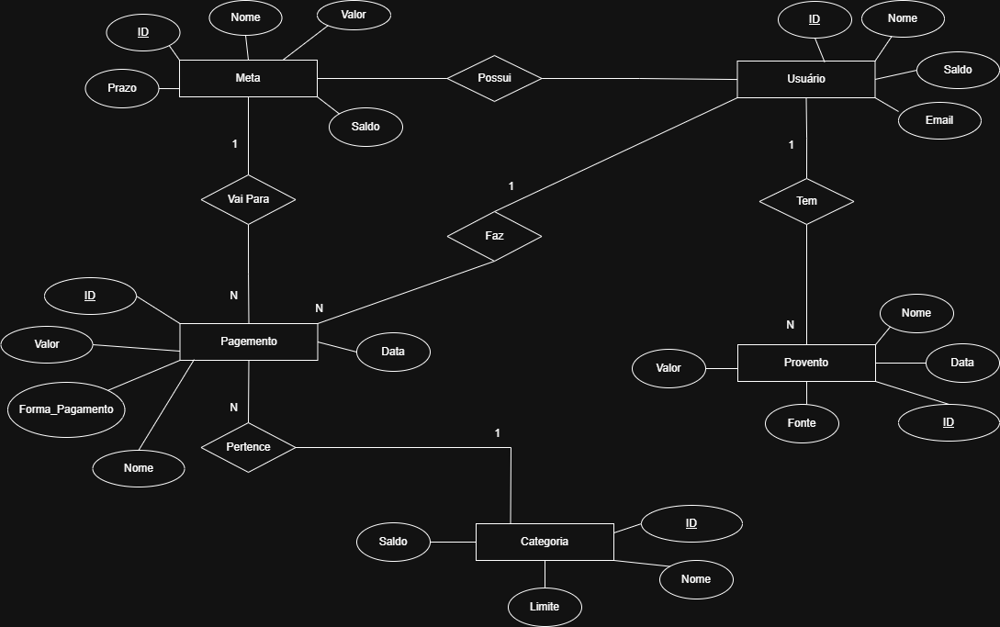
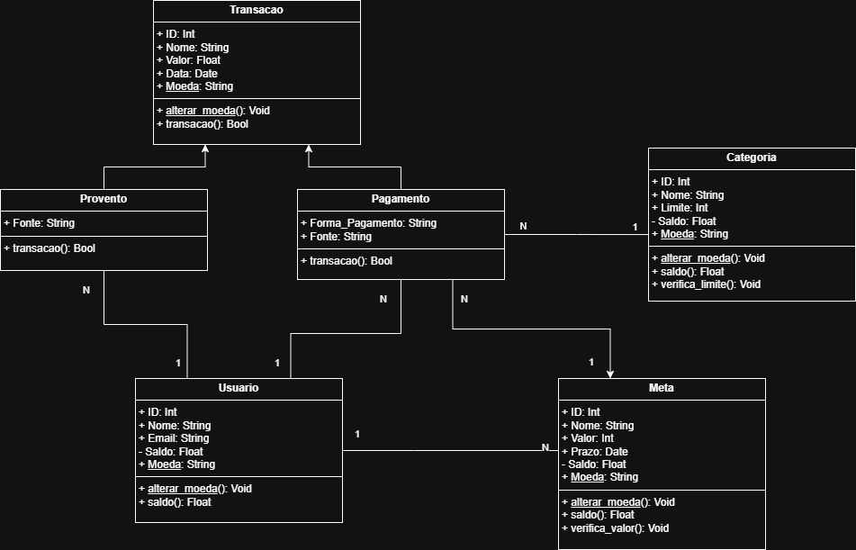

# ControleFinanceiro

    
    
    

 

 

<h1 align="center"; style="font-weight: bold;">Nome Projeto</h1>

    <a href="#sobre">Sobre</a> •
    <a href="#grupo">Grupo</a> •
    <a href="#diagrama">Diagramas</a> •
    <a href="#how-it-works">Interface e Funcionamento</a> •
    <a href="#lincença">Licença</a>

<h2 id="sobre">Sobre</h2>
Projeto desenvolvido como parte da avaliação da Matéria Programação Orientada a Objetos do curso de Análise e Desenvolvimento de Sistemas na Faculdade Impacta.
O NomeProjeto é um sistema de controle financeiro onde o usuário poderá realizar a organização de suas finanças, tendo lançamento de gastos e ganhos e as categorias a quais eles pertencem, bem como separação para metas. O programa ainda pode analisar os dados e retornar as categorias que se tem mais gastos e se alguma categoria ultrapassou o limite.

<h2 id="grupo">Integrantes</h2>
Erick 
Gustavo 
Julia 
Lucas Aguiar Nunes

<h2 id="diagrama">Diagramas</h2>

    <h3>DER</h3>
    

    <h3>UML</h3>
    

<h2 id="how-it-works">Interface e Funcionamento</h2>
Instrução de Uso - Utilização do Software ou Site (Por GIFs) e Endpoints da API

<h2 id="lincença">Licença</h2>
Licença MIT
